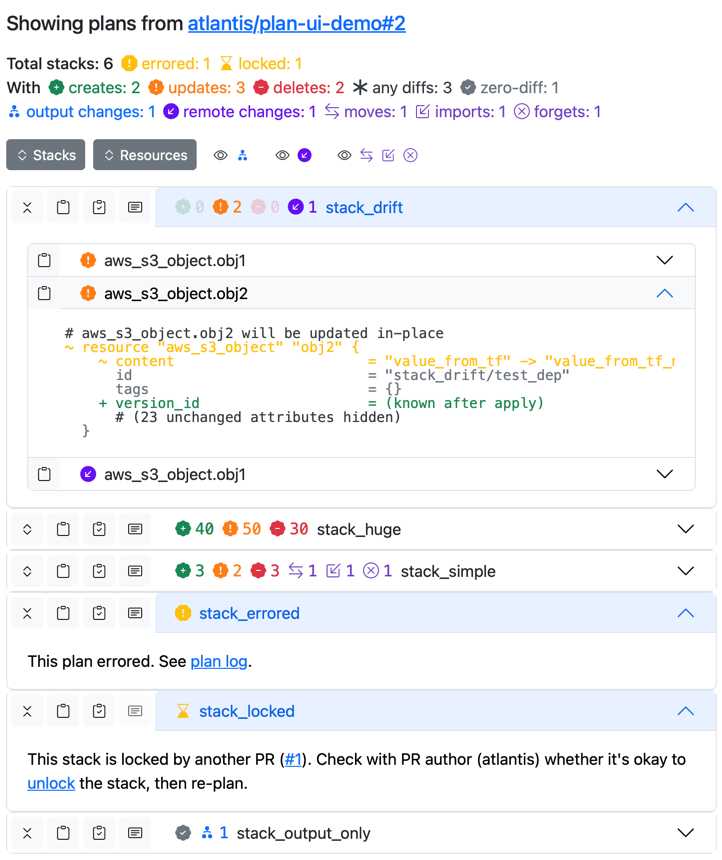

# atlantis-plan-ui

Allows you to visualize Terraform plans from Atlantis. A small web UI that shows convenient diffs, outputs, and moves.

<p float="left">
    
    
</p>

## Usage:

Firstly, you need to install `atlantis-plan-ui` to your atlantis server environment. `atlantis-plan-ui` is a single binary.

Pick your preferred method (building in docker image, adding via Helm initConfig, etc). You can grab latest binary from
[releases](https://github.com/ilyaluk/atlantis-plan-ui/releases) or build it yourself.

Check out Helm values in `demo/helm_values.yaml` for an example of how to add it to your Helm chart.

Then, add following to your repo-config:

```yaml
repos:
  - id: /.*/
    # ...
    post_workflow_hooks:
      - run: |
          atlantis-plan-ui \
            -atlantis-config /etc/atlantis/atlantis.yaml \
            # ↓ replace with atlantis-plan-ui external URL, remove this comment
            -plan-ui-url http://localhost:8080/ \
            -plans-dir $ATLANTIS_DATA_DIR/plans \
            -output-dir $ATLANTIS_DATA_DIR/plans-out \
            -vcs-repo $BASE_REPO_OWNER/$BASE_REPO_NAME \
            -vcs-pull $PULL_NUM
        commands: plan

workflows:
  default: # Use your workflow, if different
    plan:
      steps:
        # Use your own custom plan commands, if you have any
        - plan
        # Save plans for visualization.
        # Don't reuse plans from $SHOWFILE, they could be deleted by Atlantis on failed plan.
        # Save plans to a directory outside $ATLANTIS_DATA_DIR/repos dir, this breaks Atlantis logic:
        # https://github.com/runatlantis/atlantis/issues/2168
        - run: |
            PLANS_DIR=$ATLANTIS_DATA_DIR/plans/$BASE_REPO_OWNER/$BASE_REPO_NAME/$PULL_NUM/$REPO_REL_DIR
            mkdir -p $PLANS_DIR
            # if $TF_CLI_ARGS not already set in workflow:
            export TF_CLI_ARGS_show=-no-color
            terraform show $PLANFILE > $PLANS_DIR/plan.txt
            terraform show -json $PLANFILE > $PLANS_DIR/plan.json
        # If you use Terragrunt, you can do something like this:
        # You don't need to run `terragrunt show` because it would be slower for no reason.
        - env:
            name: RENDERED_STACK
            command: "terragrunt terragrunt-info 2>/dev/null | jq -r .WorkingDir"
        - run: |
            PLANS_DIR=$ATLANTIS_DATA_DIR/plans/$BASE_REPO_OWNER/$BASE_REPO_NAME/$PULL_NUM/$REPO_REL_DIR
            mkdir -p $PLANS_DIR
            export TF_CLI_ARGS_show=-no-color
            ${TERRAGRUNT_TFPATH:-terraform} -chdir=$RENDERED_STACK show $PLANFILE > $PLANS_DIR/plan.txt
            ${TERRAGRUNT_TFPATH:-terraform} -chdir=$RENDERED_STACK show -json $PLANFILE > $PLANS_DIR/plan.json
```

This assumes that data dir is set by `$ATLANTIS_DATA_DIR`, and not from config/flags, adjust accordingly.

Then, start `atlantis-plan-ui` server like that:

```bash
atlantis-plan-ui -serve :8080 -output-dir $ATLANTIS_DATA_DIR/plans-out
```

You can run it as a sidecar with shared volume in k8s, or separate docker container with shared volume.

Adjust `-plan-ui-url` in repo-config accordingly, it will be used in PR comments to link to plan UI.

You can check out `demo/` folder for a complete e2e example with Gitea, Atlantis and Atlantis Plan UI.

## Caveats

Please note that this might (and will) be unstable and break after some time due to these hideous reasons:
1. Copying Atlantis lock database without flock (becuase bbolt doesn't support it, and atlantis holds exclusive lock)
2. Parsing Atlantis lock output page to get job links (thankfully, it's not reading memory of atlantis process directly)
3. Constructing most of atlantis server (potentially with side effects) just to construct generic comment poster
4. Parsing Terraform text output manually (because all of its packages are internal, and it's the simplest way to get familiar diff output)

As of now, this relies heavily on Atlantis internals, it might break after any Atlantis update. This is tested with atlantis 0.29.0.

This is tested only in single-repo setup, additional adjustments might be needed for multi-repo setup.

## Further work

- [ ] Add API to Atlantis for grabbing pulls/locks/logs, adjust accordingly; [_issue_](https://github.com/runatlantis/atlantis/issues/4896)
- [ ] Support for imports in plan
- [ ] Support for state removals in plan (action type forget)
- [ ] Better/refactored frontend (help wanted, I'm not a frontend developer)

## Development

To test atlantis-demo-ui processing:
```bash
cd demo
./demo.sh
# Wait for PR, open other shell
go build -o demo/bin/atlantis-plan-ui .
# Comment atlantis plan to PR in gitea
# Push changes from ./demo/data/repo to get them to PR
# Run terraform commands from ./demo/data/atlantis/repos/*/*/2/default/ if needed 
```

To test UI without recompling:
```bash
cd demo
./demo.sh
# Wait for PR, open other shell
go run . -dev-ui -serve :8081 -output-dir demo/data/atlantis/plans-out
# Open http://localhost:8081/#2 in browser
# Reload on changes in ui/* files, they will be served
```
